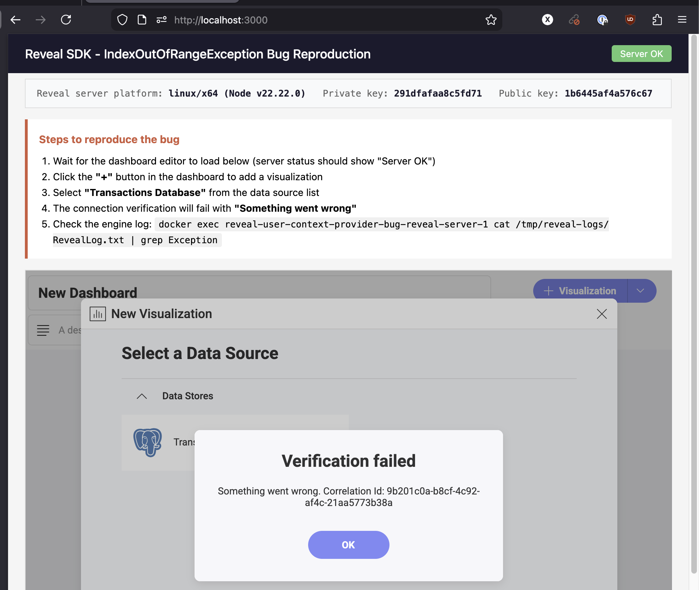
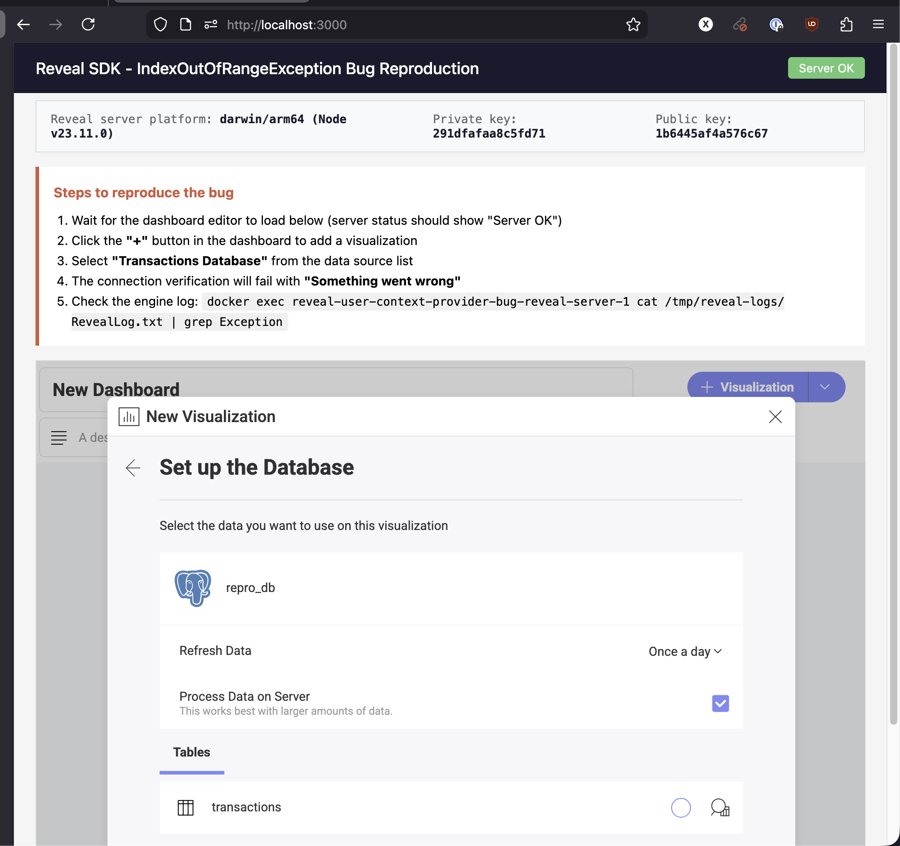

# Reveal SDK UserContextProvider Bug Reproduction

`System.IndexOutOfRangeException` in `RevealEnginePrg.UserContextProvider.GetUserContext`
on **linux-x64**. The exact same code works correctly on **osx-arm64**.

## Quick Start

```bash
cp reveal-server/.env.example reveal-server/.env
# Edit reveal-server/.env and set REVEAL_LICENSE to your license key
```

Then follow one of the two paths below.

---

## Exception from Linux

Run everything in Docker (forces `linux/amd64` for the reveal-server):

```bash
docker compose up --build
```

Open http://localhost:3000, click **"+"** to add a visualization, select
**"Transactions Database"**, and verify the connection. It fails:



The engine log confirms the exception:

```bash
docker exec reveal-user-context-provider-bug-reveal-server-1 \
  cat /tmp/reveal-logs/RevealLog.txt | grep -A5 Exception
```

```
System.IndexOutOfRangeException: Index was outside the bounds of the array.
   at RevealEnginePrg.UserContextProvider.GetUserContext(HttpContext aspnetContext)
   at Reveal.Sdk.DefaultUserContextResolver.get_UserId()
   at Infragistics.Reveal.Engine.Controllers.RevealController.ResolveUserId()
   at Infragistics.Reveal.Engine.Controllers.RevealController.VerifyConnectionByDataSource(...)
```

The crash happens regardless of:
- What the `userContextProvider` returns (valid context, null, or no provider configured)
- What HTTP headers are forwarded to the .NET engine
- Whether the request comes from a browser or curl

---

## Success from macOS

Run the reveal-server natively on macOS (osx-arm64), with postgres and the frontend in Docker:

```bash
# Terminal 1: Start postgres + frontend
docker compose up postgres frontend

# Terminal 2: Start reveal-server natively
cd reveal-server
source .env
PG_HOST=localhost npx tsx src/index.ts
```

Same steps -- click **"+"**, select **"Transactions Database"**, verify the connection.
It succeeds and lists the `transactions` table:



**Note**: The `.env` has `PG_HOST=postgres` for Docker. Override with `PG_HOST=localhost`
when running natively.

**Important**: Do NOT use `tsx watch --env-file=.env` -- the `--env-file` flag gets
passed to tsx (which ignores it), not to node. Either `source .env` before running,
or use `node --env-file=.env --import=tsx src/index.ts`.

---

## Architecture

```
frontend (nginx, port 3000)
  +-- Loads Reveal JS SDK from CDN
  +-- Signs JWT with hard-coded RSA private key
  +-- Connects to reveal-server

reveal-server (Node.js + Express, port 5111)
  +-- Verifies JWT with matching RSA public key
  +-- Mounts reveal-sdk-node middleware
  +-- userContextProvider returns RVUserContext with userId and organizationId
  +-- linux-x64 RevealEnginePrg binary crashes in GetUserContext

postgres (PostgreSQL 17, port 5432)
  +-- public.transactions table with 100 rows of sample e-commerce data
  +-- reveal.dashboards table for dashboard storage
```

## Versions Tested

| Package | Version | Result |
|---------|---------|--------|
| reveal-sdk-node | 1.8.2 | Crashes on linux-x64 |
| reveal-sdk-node | 1.8.3 | Crashes on linux-x64 |
| reveal-sdk-node | 1.8.4-rc.1 | Crashes on linux-x64 |

All versions work correctly on osx-arm64. Node.js 22.
